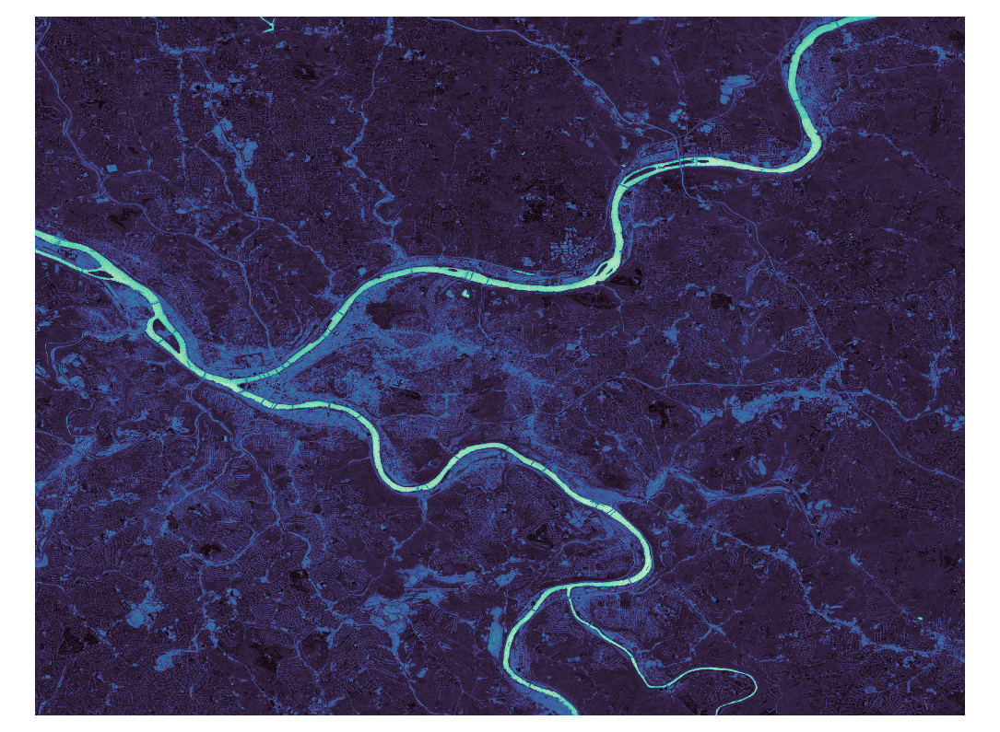
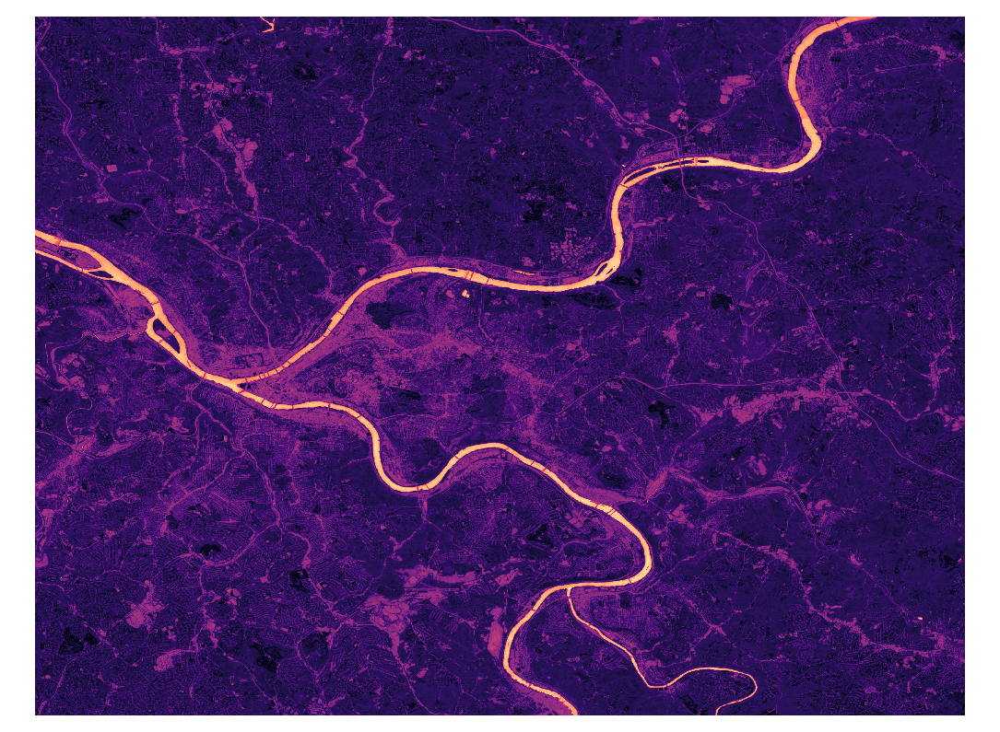

# NDWI-WaterAnalysis

## Overview
NDWI-WaterAnalysis is a Python-based tool designed for environmental scientists, geographers, and remote sensing professionals. It focuses on calculating the Normalized Difference Water Index (NDWI) from satellite remote sensing images. This tool enables the extraction of water-related features, including water bodies and water surfaces, and facilitates the calculation of water surface areas using geospatial reprojection techniques.

## Features
- **NDWI Calculation**: Compute the NDWI from satellite imagery to highlight water bodies.
- **Water Surface Extraction**: Extract water surfaces from NDWI data.
- **Area Calculation Before and After Reprojection**: Calculate the water surface area before and after reprojection to a different coordinate system.

## Prerequisites
Before you begin, ensure you have met the following requirements:
- Python 3.x installed
- Libraries: GDAL, NumPy, Rasterio (see `requirements.txt` for versions)

## Installation
Clone the repository to your local machine:
```
git clone https://github.com/waveletswave/NDWI-WaterAnalysis.git
cd NDWI-WaterAnalysis
```

Install the necessary Python packages:
```
pip install -r requirements.txt
```

## Usage
The tool is structured into several modules, each responsible for a part of the NDWI processing and water extraction workflow.

1. **NDWI Calculation**: 
   ```python
   from ndwi_calculation import calculate_ndwi
   calculate_ndwi('<path_to_green_band>', '<path_to_nir_band>', '<output_path_for_ndwi>')
   ```

2. **Water Surface Extraction**:
   ```python
   from water_extraction import extract_water_surfaces
   extract_water_surfaces('<path_to_ndwi>', '<output_path_for_water_surface>')
   ```

3. **Water Area Calculation**:
   ```python
   from water_area_calculation import calculate_water_area_before_reprojection, reproject_and_calculate_area
   calculate_water_area_before_reprojection('<path_to_water_surface>')
   reproject_and_calculate_area('<input_raster>', '<output_reprojected_raster>')
   ```

### Example Usage
To demonstrate how the NDWI-WaterAnalysis tool can be used, please refer to the `example_usage.py` script. This script provides a practical example of processing satellite images to calculate the NDWI, extract water surfaces, and calculate water area using the modules provided. Make sure to update the script with the actual paths to your own satellite image files and desired output locations.





## Contributing
Contributions to NDWI-WaterAnalysis are welcome. To contribute:
1. Fork the repository.
2. Create a new branch (`git checkout -b feature_branch`).
3. Make your changes.
4. Commit your changes (`git commit -am 'Add some feature'`).
5. Push to the branch (`git push origin feature_branch`).
6. Create a new Pull Request.

## License
This project is licensed under the [MIT License](LICENSE).

## Contact
For any queries or further assistance, please contact [waveletswave](mailto:yiyuns@andrew.cmu.edu).

---

### Notes
- Replace `<path_to_...>` and other placeholders with relevant instructions or examples specific to your project.
- Feel free to add or modify sections according to the specifics of your project, such as adding a 'Data Sources' section if you want to specify or recommend particular satellite data sets.